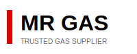

# Customization Guide for Mr Gas Website

This guide will help you customize the website to perfectly match your needs.

## Table of Contents

1. [Replacing the Logo](#replacing-the-logo)
2. [Updating Contact Information](#updating-contact-information)
3. [Modifying Colors](#modifying-colors)
4. [Changing Content](#changing-content)
5. [Adding Images](#adding-images)
6. [Updating Reviews](#updating-reviews)
7. [Adding New Sections](#adding-new-sections)
8. [Form Integration](#form-integration)

---

## Replacing the Logo

### Current Placeholder

The website includes a basic placeholder logo (`logo.svg`). Replace it with your actual Mr Gas logo.

### Steps:

1. **Get Your Logo File**
   - Request from graphic designer or use existing file
   - Preferred formats: SVG (best) or PNG
   - Recommended size: 200px wide, 60-80px tall

2. **Replace the File**
   - Delete `logo.svg`
   - Add your new logo file
   - Name it `logo.svg` or `logo.png`

3. **Update HTML (if changing format)**
   
   In `index.html`, find (appears twice):
   ```html
   
   ```
   
   Change to:
   ```html
   
   ```

4. **Adjust Logo Size (if needed)**
   
   In `styles.css`, find:
   ```css
   .logo-img {
       height: 50px;
       width: auto;
   }
   ```
   
   Modify height as needed (keep `width: auto`).

---

## Updating Contact Information

### Phone Numbers

Find and replace in `index.html`:

**Current placeholders:**
```html
<a href="tel:0835316527">083 531 6527</a>
<a href="tel:0828601090">082 860 1090</a>
<a href="tel:0163641475">016 364 1475</a>
```

**Update all instances** - appears in:
1. Hero section (Call Now button)
2. Contact section
3. Footer

**Format:** `tel:` links should have no spaces: `tel:0123456789`

### Email Address

Find and replace:
```html
gasbottleopen@gmail.com
```

Appears in:
- Contact section
- Footer
- Form submission (script.js)

### Physical Address

Update in Contact section:
```html
<p>114 Jan Neethling Road<br>Riversdale, Meyerton<br>1961, South Africa</p>
```

Also update in Footer section.

### Business Hours

Find in Contact section:
```html
<p>Monday - Friday: 8:00 AM - 5:00 PM<br>Saturday: 8:00 AM - 1:00 PM<br>Sunday: Closed</p>
```

Modify to match your actual hours.

### Google Maps Link

1. Go to [Google Maps](https://maps.google.com)
2. Search for your address
3. Click "Share" → "Embed a map"
4. Copy the link or iframe code

Update in Contact section:
```html
<a href="https://goo.gl/maps/your-actual-link" target="_blank" class="btn btn-outline">Get Directions</a>
```

---

## Modifying Colors

All colors are centralized in `styles.css` using CSS variables.

### Brand Colors

At the top of `styles.css`, find:

```css
:root {
    --primary-red: #DC0000;
    --dark-red: #B00000;
    --black: #000000;
    --dark-gray: #1a1a1a;
    --medium-gray: #333333;
    --light-gray: #666666;
    --border-gray: #e0e0e0;
    --white: #ffffff;
    --off-white: #f8f8f8;
}
```

### How to Change:

**Example: Change red to orange**
```css
:root {
    --primary-red: #FF6B00;  /* Orange instead of red */
    --dark-red: #CC5500;     /* Darker orange */
}
```

**Example: Use blue instead**
```css
:root {
    --primary-red: #0066CC;  /* Blue */
    --dark-red: #004C99;     /* Darker blue */
}
```

### Finding Your Brand Colors

If you have a logo, use a color picker tool:
- [ImageColorPicker.com](https://imagecolorpicker.com/)
- [ColorZilla](https://www.colorzilla.com/) (browser extension)

Upload logo → Click on color → Get hex code

---

## Changing Content

### Hero Section

In `index.html`, find the hero section:

```html
<h1 class="hero-title">Meyerton's Trusted Gas Supplier for Over 30 Years</h1>
<p class="hero-subtitle">Reliable service, competitive pricing, and always in stock...</p>
```

**Tips:**
- Keep headline short (under 60 characters)
- Focus on your main value proposition
- Mention years of service if applicable

### About Section

Find the about text:
```html
<p class="about-intro">Welcome to Mr Gas...</p>
```

**Customize to tell your story:**
- When you started
- Why customers choose you
- What makes you different
- Your commitment to service

### Services

Each service card follows this structure:
```html
<div class="service-card">
    <div class="service-icon">🔥</div>
    <h3>LP Gas Refills</h3>
    <p>Description of service...</p>
</div>
```

**To add a service:**
1. Copy an existing service card
2. Change the emoji icon
3. Update title
4. Write new description

**Emoji Icon Ideas:**
- 🔥 Fire/Gas
- ⚡ Energy
- 🛠️ Tools/Equipment
- 🏭 Industrial
- 🔧 Maintenance
- 💼 Business
- 🚚 Delivery
- ✅ Quality

### Trust Badges

Update the numbers in hero section:
```html
<strong>30+ Years</strong>
<strong>4.3/5 Rating</strong>
<strong>Always in Stock</strong>
```

---

## Adding Images

### Adding Photos to Services

1. **Prepare Images**
   - Resize to 800x600px or similar
   - Optimize (use [TinyPNG.com](https://tinypng.com/))
   - Save as .jpg or .webp

2. **Add Image Files**
   - Place in an `images` folder
   - Name logically: `gas-refill.jpg`, `welding-gases.jpg`

3. **Update HTML**

Replace service icon with image:
```html
<!-- Before -->
<div class="service-icon">🔥</div>

<!-- After -->

```

4. **Add CSS Styling**

In `styles.css`, add:
```css
.service-image {
    width: 100%;
    height: 200px;
    object-fit: cover;
    border-radius: 8px;
    margin-bottom: 20px;
}
```

### Adding Background Images

For hero section, add to `styles.css`:

```css
.hero {
    background: linear-gradient(rgba(0,0,0,0.7), rgba(0,0,0,0.7)), 
                url('images/hero-background.jpg');
    background-size: cover;
    background-position: center;
}
```

---

## Updating Reviews

### Current Review Template

```html
<div class="review-card">
    <div class="review-stars">★★★★★</div>
    <p class="review-text">"Customer quote here..."</p>
    <p class="review-author">— Customer Name</p>
</div>
```

### Best Practices:

1. **Get Permission** from customers to use testimonials
2. **Use Real Names** (first name or initials if privacy concern)
3. **Keep Authentic** - don't make up reviews
4. **Vary Star Ratings** - not all 5 stars (4.0-5.0 range is realistic)

### Star Rating Guide:

```html
★★★★★  <!-- 5 stars -->
★★★★☆  <!-- 4 stars -->
★★★☆☆  <!-- 3 stars -->
```

### Adding More Reviews:

Copy the entire review card div and modify:

```html
<div class="review-card">
    <div class="review-stars">★★★★☆</div>
    <p class="review-text">"Your actual customer testimonial here. Keep it authentic and specific."</p>
    <p class="review-author">— John D., Local Business Owner</p>
</div>
```

---

## Adding New Sections

### Creating a Products Section

After services section, add:

```html
<section class="products" id="products">
    <div class="container">
        <div class="section-header">
            <h2 class="section-title">Our Products</h2>
            <p class="section-subtitle">Quality gas products for every need</p>
        </div>
        <div class="services-grid">
            <!-- Copy service cards here and modify for products -->
        </div>
    </div>
</section>
```

Add navigation link:
```html
<li><a href="#products" class="nav-link">Products</a></li>
```

### Creating a Gallery Section

```html
<section class="gallery" id="gallery">
    <div class="container">
        <div class="section-header">
            <h2 class="section-title">Our Facility</h2>
        </div>
        <div class="gallery-grid">
            
            
            
            <!-- Add more images -->
        </div>
    </div>
</section>
```

Add CSS:
```css
.gallery-grid {
    display: grid;
    grid-template-columns: repeat(auto-fit, minmax(300px, 1fr));
    gap: 20px;
}

.gallery-grid img {
    width: 100%;
    height: 300px;
    object-fit: cover;
    border-radius: 8px;
    cursor: pointer;
    transition: transform 0.3s ease;
}

.gallery-grid img:hover {
    transform: scale(1.05);
}
```

---

## Form Integration

### Option 1: Formspree (Recommended - Easy)

1. **Sign up** at [Formspree.io](https://formspree.io/)
2. **Create a form** and get your endpoint
3. **Update form in index.html:**

```html
<form class="contact-form" id="contactForm" 
      action="https://formspree.io/f/YOUR_FORM_ID" 
      method="POST">
    <!-- rest of form -->
</form>
```

4. **Remove JavaScript handling** from script.js (or keep for validation)

### Option 2: Netlify Forms

If hosted on Netlify:

```html
<form class="contact-form" name="contact" method="POST" data-netlify="true">
    <input type="hidden" name="form-name" value="contact">
    <!-- rest of form fields -->
</form>
```

### Option 3: EmailJS

1. **Sign up** at [EmailJS.com](https://www.emailjs.com/)
2. **Add EmailJS script** before closing `</body>`:

```html
<script src="https://cdn.jsdelivr.net/npm/@emailjs/browser@3/dist/email.min.js"></script>
<script>
    (function(){
        emailjs.init("YOUR_PUBLIC_KEY");
    })();
</script>
```

3. **Update form handling** in script.js

### Option 4: Google Forms (Alternative)

1. Create Google Form
2. Get form action URL
3. Map field names to Google Form field IDs
4. Update form action in HTML

---

## Advanced Customizations

### Adding Animation Effects

In `styles.css`, you can enhance animations:

```css
/* Fade in on scroll */
.fade-in {
    opacity: 0;
    transform: translateY(30px);
    transition: all 0.6s ease;
}

.fade-in.visible {
    opacity: 1;
    transform: translateY(0);
}
```

Then in `script.js`, add intersection observer to trigger.

### Adding a Blog Section

Create new file `blog.html`:

```html
<!DOCTYPE html>
<html lang="en">
<head>
    <!-- Copy head from index.html -->
    <title>Blog - Mr Gas</title>
</head>
<body>
    <!-- Copy navigation from index.html -->
    
    <section class="blog">
        <div class="container">
            <h1>Gas Safety Tips & News</h1>
            <!-- Blog content -->
        </div>
    </section>
    
    <!-- Copy footer from index.html -->
</body>
</html>
```

Add link in navigation.

### Multi-language Support

For English/Afrikaans:

1. Create `index-af.html` (Afrikaans version)
2. Add language switcher in navigation
3. Translate all content
4. Add hreflang tags for SEO

---

## Testing Your Changes

### Before Deploying:

1. **Test Locally**
   - Open index.html in browser
   - Check all links work
   - Test on mobile (Chrome DevTools)

2. **Validate HTML**
   - Use [W3C Validator](https://validator.w3.org/)
   - Fix any errors

3. **Check Responsive Design**
   - Test on phone, tablet, desktop
   - Use browser developer tools

4. **Performance Check**
   - Use [PageSpeed Insights](https://pagespeed.web.dev/)
   - Optimize images if needed

5. **Cross-Browser Test**
   - Chrome
   - Firefox  
   - Safari
   - Edge

---

## Need Help?

If you get stuck:

1. Check browser console for JavaScript errors (F12)
2. Validate HTML and CSS
3. Search for error messages
4. Open an issue on GitHub
5. Consult the [DEPLOYMENT.md](DEPLOYMENT.md) guide

---

## Quick Reference

**File Structure:**
- `index.html` - Main content
- `styles.css` - All styling
- `script.js` - Interactive features
- `logo.svg` - Logo file

**Common Changes:**
- Contact info: Edit `index.html`
- Colors: Edit `:root` in `styles.css`
- Content: Edit `index.html`
- Behavior: Edit `script.js`

---

Happy customizing! Make this website truly yours. 🎨
